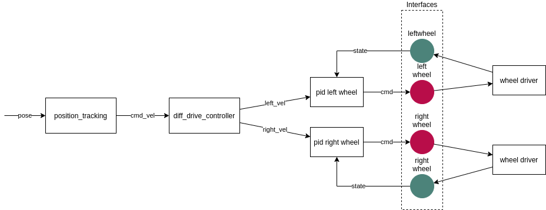

# Chaining Controllers

## Motivation

The goal of chaining controller is not to create a complete framework like Simulink, but to provide developers with a solution to chain controllers input/output to each others. Controllers can be chain in [Sequence or in Parallel.](controller_execution_management.md)

### Example 1

A typical use case for this is a safety `JointLimitsController` which is being linked after a `JointEffortController` to enforce an operation within appropriate min/max torque values

### Example 2

Another use case would be to add a PID at the output of a diff_drive_controller for each wheel. And even adding a position_tracker controller at the input of the diff_driver_controller.

## Input & Outputs of a controller

In order to chain controllers, inputs and outputs must be defined. 

### Current controllers and ROS interfaces

The existing controllers usually implement ros interfaces to communicate with ROS. Often those interfaces provide inputs to the controller.
It is not clear how we could handle chaining two controllers of that kind, as this would require replacing the ROS interfaces with something else. Another Handle, maybe ?

### The other inputs: a new interface type ?

When chaining controllers that take inputs that are neither CommandInterface nor StateInterface. How should we define those ?
Should we create a new type of interface (`OtherInterface`) and a new virtual `other_interface_configuration()` method?

Since it is up to the user to decide wether he wants to implement a chainable controller, we can introduce a `ChainableController` class that implements those new types and virtual methods.

Controllers, which inherits from `ChainableController` would have to implement this method to define non-ros interfaces

> question: should we make all controllers chainable?
> idea: maybe ros-interfaces can inherit from `OtherInterface` ?

## Reusability of a sub-controller

### Granularity

While it could be possible to split controllers such as a PID controller into three sub-controllers (P, I, D) which can be re-used individually. Would that really be useful? While there might be a need for P-Controller, is there any for an I-Controller or even a D-Controller?

## Controller Group

> **WARNING** this section is still under construction...

A `ControllerGroup` which inherits from `ControllerInterface` or `ChainableController` class could allow adding sub-controllers via an `add_controller(ChainableController& )` method. 

### Interface Configuration of a group

The command and state interfaces claimed by a `ControllerGroup` will be a concatenation of all sub-controllers interfaces. It will store an `std::map<ControllerInterface, InterfaceConfiguration>`

### Assignment

During assignment,

- if a StateInterface exists, it will be assigned to the sub-controller
- if a StateInterface does not exist, return ERROR
- if a CommandInterface exist, claim and assign it
- if a CommandInterface does not exist, check if an `OtherInterface` with the same name exist, claim and assign it

### Chaining

For each sub-controller, the `ControllerGroup` will create a `FakeCommandInterface` and `FakeStateInterface` that will be loaned during interface assignment. 

The ControllerGroup will implement how the inputs  all controllers are connected. Two classic chaining such as Sequence and Parallel will be implemented. But we can leave the option open for other type of chaining.

## Nesting controllers

Easy, group controllers inherit from `ControllerInterface`

