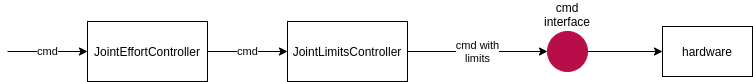

# Chaining Controllers

> **DISCLAIMER WORK IN PROGRESS!!**: This document serves as a support to discuss the challenges and possible implementation for chaining controllers. It is **NOT** a final solution.

## Motivation

The goal of chaining controller is not to create a complete framework like Simulink, but to provide developers with a solution to chain controllers input/output to each others. Controllers can be chain in [Sequence or in Parallel.](controller_execution_management.md)

### Example 1

A typical use case for this is a safety `JointLimitsController` which is being linked after a `JointEffortController` to enforce an operation within appropriate min/max torque values

### Example 2

Another use case would be to add a PID at the output of a diff_drive_controller for each wheel. And even adding a position_tracker controller at the input of the diff_driver_controller.

In this example, we want the `position_tracking` controller to output a `cmd_vel` to an interface that will be an input of the diff_drive_controller.

## Input & Outputs of a controller

In order to chain controllers, inputs and outputs must be defined.

### Current controllers and ROS interfaces

The existing controllers usually implement ros interfaces to communicate with ROS.  Often those interfaces provide inputs to the controller. 
It is not clear how we could handle chaining two controllers of that kind, as this would require replacing the ROS interfaces with something else. Another Handle, maybe ?

> For example the diff_driver_controller takes a `cmd_vel` Twist Message input. We want to chain a position_tracker that outputs a `cmd_vel` Data to the diff_drive_controller.

### The other inputs: a new interface type ?

How should we define inputs of controllers that are neither CommandInterface nor StateInterface. 
Should we create a new type of interface (`InputInterface`) and a new virtual `input_interface_configuration()` method?

Since it is up to the user to decide wether he wants to implement a chainable controller, we can introduce a `ChainableController` class that implements those new types and virtual methods.

Controllers, which inherits from `ChainableController` would have to implement this method to define non-ros interfaces

> question: should we make all controllers chainable?
> idea: maybe ros-interfaces can inherit from `InputInterface` ?

## Reusability of a sub-controller

### Granularity

While it could be possible to split controllers such as a PID controller into three sub-controllers (P, I, D) which can be re-used individually. Would that really be useful? While there might be a need for P-Controller, is there any for an I-Controller or even a D-Controller?

## Controller Group

A `ControllerGroup` which inherits from `ControllerInterface` or `ChainableController` class could allow adding sub-controllers via an `add_controller(ChainableController& )` method. The `ControllerGroup::update()` method will implement an order for chaining controllers. For a `ControllerSequenceGroup`, the method will simply call in sequence the update of each sub-controller.

### Inner Resource Management

The controller group will hold a FakeResourceManager object. For each claimed Interface of each sub-controller, the ControllerGroup will create a FakeResource inside of the FakeResourceManager. During assigment, sub-controllers will be loaned a FakeStateInterface linked to the FakeResource.

### Interface Configuration of a group

The command and state interfaces claimed by a `ControllerGroup` will be a concatenation of all sub-controllers interfaces. It will store an `std::map<ControllerInterface, InterfaceConfiguration>`

### Chaining

Chaining can be achieved by matching interface names.
Example: the diff_drive_controller claims an `InputInterface` called *cmd_vel*, the pose_tracking claims a `CommandInterface` called *cmd_vel* as well.
Those two Interface can then be linked.

## Nesting controllers

Since a ControllerGroup inherit from `ChainableController`, they can be chained and nested.

## Possible Implementations

### ros2 as an inter-controller middleware

One idea was to used ros2 topics to communicate between two controllers.
However, this is not real-time safe, and ros2 topics are asynchronous.

### Using a new InputInterface.

A new method called `input_interface_configuration()` would allow a controller to define the `InputInterface` of the controller.
