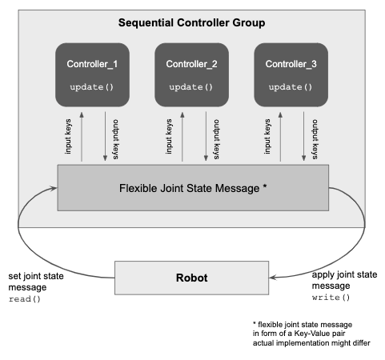
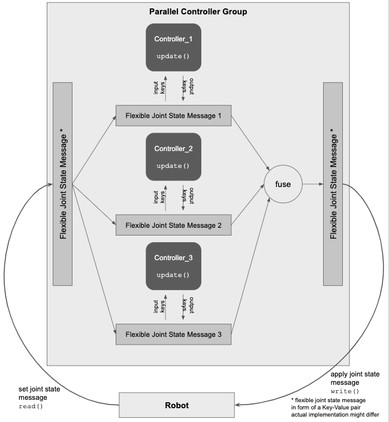
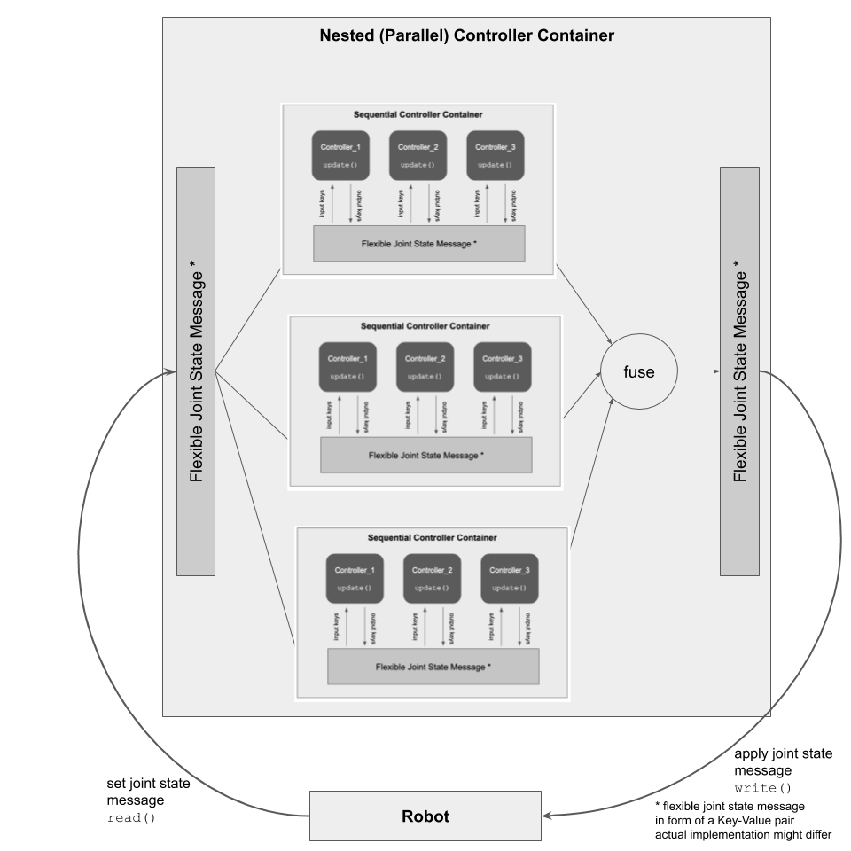

# Controller Execution Management

The following shall discuss the execution of loaded controllers inside the `ControllerManager`.
As of today, the loaded controllers are processed in a sequential order which doesn't allow for much flexibility or interoperability between the controllers.
We identified a few essential criteria when it comes to the execution of controllers:

* Sequential Execution of Controllers
* Parallel Execution of Controllers
* Nesting Controllers
* Variable Frequencies of Controllers

We'll go into more details below for each aspect.

## Prerequisites

### Flexible Joint State Message

Over the course of this document, we are referring to a "Flexible Joint State Message".
This data type is precisely described in [here](flexible_joint_states_msg.md).

What is important to understand for this article is that this joint state message serves as a general container structure for various, dynamically specified key values pairs.
Every controller can hereby access values which are specific to itself without being limited to a set of pre-defined keys.
For example can a `JointEffortController` access the robot's input state via keys like `joint_position` and `joint_velocity` and write its output torque under a key such as `torque_command`.
This further allows an easy extensibility in the variety of controllers which could access data completely independent of their underlying hardware.
Various components such as camera systems or third-party peripherals can therefore be combined and shared between controllers.
A typical example for this are visuomotor controllers where camera images are used to generate torque values.
Relevant features extracted from camera inputs can so be shared between multiple controllers to eventually calculate the appropriate control command.

### Controller and Hardware Interface

Each controller gets the previously mentioned joint state message attached during their initialization phase.
The controller manager is responsible to initialize the joint state message appropriately and route it correctly to each controller.
It is further the task of the controller manager to fill the message with a call to `read` from the connected hardware interface and apply the results from the controllers accordingly with a call to `write`.

Each individual implementation for a hardware then reads the appropriate values out of the flexible joint state message and applies these on the actual hardware.

To gain some insights about which keys each controller requires, the `ControllerInterface` specifies two abstract methods each controller implementation has to define.
With `get_input_keys` the controller has to specify a list of keys which are being used to fetch its input state from the attached joint state message.
Respectively, with `get_output_keys` the controller specifies a list of keys it is modifying inside the joint state message.

### Resource Management

While the general container structure with key-value pairs offers a great deal of flexibility, it has to be guaranteed that no concurrent access of the same key can happen during runtime.
The controller manager has to make sure that controllers don't collide with their input and output keys.

One could argue that input keys should generally be flagged as read-only to keep the input state of the hardware in a valid state.
This however disables basic functionality such as clamping where the input key would be the same as the output key or any other use case where a key-value pair is getting modified in place.

## Sequential Execution of Controllers

All loaded controllers are currently executed in a strict round-robin order.
That is, there is a tight order starting from `Controller_1`, `Controller_2`, …, `Controller_N`, where all controllers are running independent from each other.

### Controller Chaining

One requirement we'd like to see is a more flexible controller chaining.
Controller chaining still implies a fixed configuration in which order the controllers are being executed, however with shared resources.
A typical use case for this is a safety `JointLimitsController` which is being linked after a `JointEffortController` to enforce an operation within appropriate min/max torque values.
Another use case could be to clamp a `DiffDriveController` velocity values to optimize for battery lifetime or top acceleration.

In order to realize such a controller chaining, the output of one's controller must be linked as the input to its consecutive controller.
This further motivates a relaxation that resources such as the `JointHandle` can only be uniquely claimed.

### Sequential Controller Container

Instead of loading each controller individually as an independent controller, we propose a parent container which holds and connects controllers which are configured in a specific order.
The container has a single input and a single output which is being scoped within the container.
That is, all controllers loaded within a container don't see any input/output states outside the container.
The input and output states can then be safely re-routed and linked between individual controllers.
After all controllers are executed, the final output state is being returned from the container.

The image below shows how this execution model could look like:

## Parallel Execution of Controllers

Complementary to sequential execution, there are use cases where it makes sense to operate controllers in a parallel fashion.
`Controller_1`, `Controller_2`, …, `Controller_3` are being executed in parallel, each operates on a copy of the group's input and individual output states are being fused with a specific strategy.

### Separation of Tasks

Having controllers being run in parallel allows a better separation of tasks per controller.
One easy to grasp example (also if not the most sensible) is a simple `PID-Controller`.
We could break down each gain (`P`, `I`, `D`) in its own controller and let them calculate in isolation.
By being able to execute multiple controllers in parallel, the calculation of the actual output can then be to simply add the `P`, `I`, `D` outputs - according to the control law of `p * (x_d - x) + p * (x_d - x) / dt  + i * sum(x_d -x) * dt`.
A second use case could be again a differential drive controller which computes rotational and translational velocities and a second controller calculates dynamic friction values which then again can be fused together.

### Parallel Controller Container

Just like in the sequential execution, we propose having a container structure which holds a set of loaded controllers which are being executed in parallel and primarily independent from each other.
When all controllers were executed, each individual calculated values are being joined.
As already mentioned previously, this parallel container can be initialized with a custom designed operation which dictates how all commonly calculated values (e.g. `torques`) are being combined.

The parallel container also has only one input and one output state.
However, the input state has to be multiplexed (essentially copied) for each controller and can't be shared in order to guarantee and isolated execution where no other controller within the same container can interfere.

The image below shows how this execution model could look like:

## Nested Controllers

In both cases, the sequential as well as the parallel container can be controllers in itself.
That gives the flexibility to easily nest the container within another container transparently.
Again, a very simple scenario could be a parallel `PID` controller setup which is then being configured within a sequential container to enforce joint limits.
This further allows to consider maybe very complex configured containers as black boxes, yet have the freedom to extend these fairly easy.

The image below shows how this execution model could look like:

## Variable Controller Frequencies

One big constraint of the round-robin approach is the constant update frequency for all loaded controllers.
There are plenty of use-cases however where it makes sense to have variable update frequencies, such as running a robot controller with 1 kHz whereas a camera controller only receives new images with a 20 Hz frequency.
Every controller should therefore be attached with its own update frequency.

Looking at the `rclcpp executor` model, one approach could be to start a timer for each controller where its callback will call the respective `update()` function.
In order to establish a deterministic behavior of the timers, the controller manager has to make sure that really only timers are started and no other blocking calls such as subscriptions or services are part of it.
There is quite some discussion about this at the moment of writing here: https://answers.ros.org/question/327477/ros2-uses-6-times-more-cpu-than-fastrtps/

The potential options are having a separate executor designed for ros control with adheres to the interface of the `rclcpp::executor` or to neglect the concept and implement a custom execution model for ros_control.

## Implementation - Proof of Concept

for full details see https://github.com/Karsten1987/cm_poc
