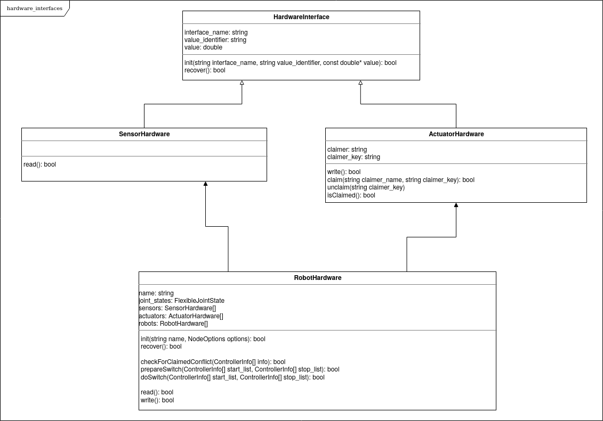

# Structure of Hardware Interfaces

The following shall discuss the design of data structures in the `hardware_interface` package for ROS2.
The document deals only with hardware description, but this also depends on [controllers execution management design].
As of today (ROS1), a `robot` is a fundamental and rigid structure that handles any hardware.
Therefore to extend it with additional hardware, like sensors, actuators, and tools, without coding and recompiling it.
This design tries to achieve the following:

* Consistent naming of classes with the wording used in control theory (should simplify starting for new users);
* Logical implementation of relations between robots, sensors, actuators and finally controllers (should simplify starting for new users);
* Easy extension of a robot with additional hardware (no need for compilation).

## Motivation

The `RobotHW` class in ROS1 is the basic structure for representing any hardware, robots, sensors, and actuators.
From the control theory perspective, a robot is an assembly with one or more sensors and actuators.
Therefore we should strive such a design, primarily because it provides a few pleasing side effects:

* Simple extension with additional hardware (e.g., extending an industrial robot with an additional sensor on the TCP );
* Dynamic extension of a robot with other equipment (e.g., tool changers);
* Reuse of hardware definitions and interfaces without a need for coding and compiling of robot hardware.

## Nomenclature

### Robot Hardware

A robot is logically represented with the `RobotHardware` class.
This structure has at least one sensor and one actuator, but it generally represents any composition of `RobotHardware`, `SensorHardware`, and `ActuatorHardware` structures.
Specific implementation takes care to read/write data to physical hardware properly.
A specific implementation of the `RobotHardware` decides if the data are received/sent at once (e.g., industrial robot). Its sensors and actuators can read/write from/to physical hardware (e.g., a sensor attached to a robot's TCP).

### Sensor Hardware

A sensor in a robotic system is represented with the `SesorHardware` class.
Only data reading is possible from this type of hardware.
Therefore no resource conflict is possible, and it will not be checked.

### Actuator Hardware

An actuator in a robotic system is represented with the `ActuatorHardware` class.
Only data writing is possible for this type of hardware.
Resource conflict should be strictly checked, managed, and protected (e.g., by a key provided by a specific controller).

## Structure Diagram

The class diagram would somewhat like this:

<!-- List of References -->
[controllers execution mangagemnt design]:https://github.com/Karsten1987/roadmap/blob/controller_execution_management/design_drafts/controller_execution_management.md
