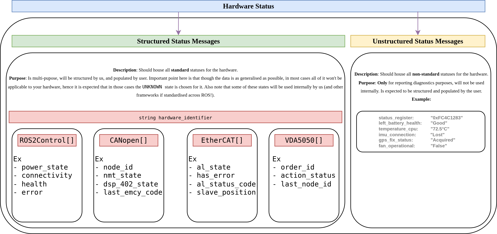

# Standardized Hardware Status Reporting

## Short description

This proposal is an attempt at a standardized way for hardware components in `ros2_control` to report their status.

Right now, if you're writing a hardware interface, how you report things like health, errors, or connectivity is pretty much up to you. This usually means everyone rolls their own custom messages. While that works for a single project, it makes it really tough to build generic, reusable tools on top of `ros2_control` (and even internally!). This proposal is a first-pass attempt at defining a generic `HardwareStatus` message. The main goal is to find a good balance between a structured, predictable format that tools can rely on, and the flexibility needed to report all the weird, wonderful, and specific details of different hardware.

This is very much a draft to get the conversation started, not a final solution!

Here's a diagram I put together to visualize it:



Let's discuss this in slightly more detail.

## 1. The Idea: Structured vs. Unstructured

The core idea is to split status reporting into two complementary parts.

1.  **Structured, Standards-Based Status:**
    - A fixed set of fields covering \~80% of common hardware needs—machine-readable, reliable, and directly consumable by controllers, watchdogs, automation tools and even for us internally.
    - A collection of status messages, where each message type corresponds to a specific industry standard (e.g., `CANopenState`), providing a machine-readable and reliable format.
    - A hardware interface populates only the status blocks relevant to it within a single, component-specific message, covering the common hardware needs for controllers, watchdogs, and automation tools.

2.  **Unstructured Status:**
    - A free-form array of key/value diagnostics for everything else—geared toward logs, dashboards, and human inspection only.
    - A slower, richer stream of `diagnostic_msgs/KeyValue[]`, strictly for debugging and UI, ideally not parsed by control loops.

## 2. Example Message Topology

We separate **real-time status** (fast, small) from **detailed diagnostics** (bulkier, slower) on two topics:

| Topic                          | Msg Type                           | Rate     | Intended Use                                |
| ------------------------------ | ---------------------------------- | -------- | ------------------------------------------- |
| `/hardware_status`             | `control_msgs/HardwareStatus`      | 1–50 Hz  | Health, ops & safety logic, auto‐monitoring |
| `/hardware_diagnostics` | `control_msgs/HardwareDiagnostics` | 0.1–1 Hz | GUI dashboards, logs, debugging             |

## 3. Structured Status: `HardwareStatus`

The foundation of this approach is the `HardwareStatus` message. A single publisher on the `/hardware_status` topic would publish an array of these messages, one for each component in the system.

```
# control_msgs/msg/HardwareStatus

std_msgs/Header header        # timestamp + frame_id (optional)
string           hardware_id  # unique per‐instance, e.g. "left_wheel/driver"

# ——— Standard-Specific States ——————————————————————————————————————
# States populated based on the standards relevant to this component.
# A component will only fill the arrays for the standards it implements, rest will be empty
ROS2ControlState[]     ros2control_states
CANopenState[]         canopen_states
EtherCATState[]        ethercat_states
VDA5050State[]         vda5050_states
```

### 3.1. Standardized State Messages

Below are the proposed initial standard-specific messages, based on widely used industrial standards. Additions and opinions here would be really appreciated!

---

**`ros2_control` Generic State**

This message encapsulates the general-purpose status fields, serving as a baseline for any hardware interface.

```
# control_msgs/msg/ROS2ControlState

# ——— Health & Error ——————————————————————————————————————————————
uint8  health_status         # see HealthStatus enum
uint8[]  error_domain        # Array of device errors, see ErrorDomain enum

# ——— Operational State ———————————————————————————————————————————
uint8  operational_mode      # see ModeStatus enum
uint8  power_state           # see PowerState enum
uint8  connectivity_status   # see ConnectivityStatus enum

# ——— Vendor & Version Info ————————————————————————————————————————
string manufacturer          # e.g. "Bosch"
string model                 # e.g. "Lidar-XYZ-v2"
string firmware_version      # e.g. "1.2.3"

# ——— Optional Details for Context —————————————————————————————————
# Provides specific quantitative values related to the enums above.
# e.g., for power_state, could have {key: "voltage", value: "24.1"}
# e.g., for connectivity, could have {key: "signal_strength", value: "-55dBm"}
diagnostic_msgs/KeyValue[] state_details
```

#### `ROS2ControlState` Enums
```
# control_msgs/msg/ROS2ControlState (enums)

# High-level health
uint8 HEALTH_UNKNOWN=0
uint8 HEALTH_OK     =1
uint8 HEALTH_DEGRADED=2
uint8 HEALTH_WARNING =3
# Hardware stops publishing state when it returns ERROR/FATAL, how are these set/updated?
uint8 HEALTH_ERROR   =4
uint8 HEALTH_FATAL   =5

# Error category
uint8 ERROR_NONE    =0
uint8 ERROR_UNKNOWN =1
uint8 ERROR_HW # generic hardware fault/error
uint8 ERROR_SW # generic software fault/error
uint8 ERROR_OVER_TRAVEL # Hardware stopped motion because position is over limits

# Hardware/Software status
uint8 EMERGENCY_STOP_HW # state of the emergency stop hardware (i.e. e-stop button state)
uint8 EMERGENCY_STOP_SW # state of the emergency stop software system (over travel, pinch point)
uint8 PROTECTIVE_STOP_HW # state of the protective stop hardware (i.e. safety field state)
uint8 PROTECTIVE_STOP_SW # state of the software protective stop
uint8 SAFETY_STOP
unit8 CALIBRATION_REQUIRED


# Mode of operation
uint8 MODE_UNKNOWN    =0
uint8 MODE_MANUAL     =1
uint8 MODE_AUTO       =2 # automatic mode when the driver is remote controlling the hardware
uint8 MODE_SAFE       =3 # what is the expected use case for this mode?
uint8 MODE_MAINTENANCE=4
uint8 MODE_JOG_MANUAL
uint8 MODE_ADMITTANCE
uint8 MODE_MONITORED_STOP
uint8 MODE_HOLD_TO_RUN
unit8 MODE_CARTESIAN_TWIST
unit8 MODE_CARTESIAN_POSE
uint8 MODE_TRAJECTORY_FORWARDING
uint8 MODE_TRAJECTORY_STREAMING

# Power states
uint8 POWER_UNKNOWN   =0
uint8 POWER_OFF       =1
uint8 POWER_STANDBY   =2
uint8 POWER_ON        =3
uint8 POWER_SLEEP     =4
uint8 POWER_ERROR     =5
# Battery power states see [BatteryState.msg](https://docs.ros2.org/foxy/api/sensor_msgs/msg/BatteryState.html)
uint8 POWER_LEVEL_LOW
uint8 POWER_LEVEL_CRITICAL
uint8 POWER_CHARGING
uint8 POWER_CHARGING_ERROR

# Connectivity
uint8 CONNECT_UNKNOWN =0
uint8 CONNECT_UP      =1
uint8 CONNECT_DOWN    =2
uint8 CONNECT_FAILURE =3
uint8 CONNECTION_SLOW # to tell the controlling system it is struggling to communicate at rate
```

---

**CANopen State**

Reports state according to CiA 301 and CiA 402, common for motor drives and I/O.
-   **Source:** [CAN in Automation (CiA)](https://www.can-cia.org/) - CiA 301 & 402 specifications.

```
# control_msgs/msg/CANopenState

uint8  node_id           # The CANopen node ID of the device

# ——— CiA 301 State —————————————————————————————————————————————————
uint8  nmt_state         # Network Management state (e.g., OPERATIONAL)

# ——— CiA 402 State (for drives) ————————————————————————————————————
uint8  dsp_402_state     # Drive state machine state (e.g., OPERATION_ENABLED)

# ——— Error Reporting ———————————————————————————————————————————————
uint32 last_emcy_code    # Last Emergency (EMCY) error code received
```

---

**EtherCAT State**

Reports the EtherCAT slave state according to the EtherCAT State Machine (ESM).
-   **Source:** [EtherCAT Technology Group (ETG)](https://www.ethercat.org/en/downloads.html) - ETG.1000.4 EtherCAT Protocol Specifications.

```
# control_msgs/msg/EtherCATState

uint16 slave_position    # Position of the slave on the bus (0, 1, 2...)
string vendor_id         # Unique vendor identifier
string product_code      # Unique product code for the device

# ——— EtherCAT State Machine (ESM) ——————————————————————————————————
uint8  al_state          # Application Layer state (INIT, PREOP, SAFEOP, OP)
bool   has_error         # True if the slave is in an error state
uint16 al_status_code    # AL Status Code indicating the reason for an error
```

---

**VDA5050 State**

For AGVs and AMRs compliant with VDA5050, this provides a snapshot of the vehicle's high-level status.
-   **Source:** [Verband der Automobilindustrie (VDA)](https://github.com/VDA5050/VDA5050) - VDA 5050 Specification.

```
# control_msgs/msg/VDA5050State

# ——— Order and Action Status ———————————————————————————————————————
string order_id          # ID of the currently executed order
string action_status     # e.g., RUNNING, PAUSED, FINISHED, FAILED
uint32 last_node_id      # ID of the last reached node in the topology

# ——— Vehicle State —————————————————————————————————————————————————
bool   driving           # True if the vehicle's drives are active
float64 battery_charge   # Current battery charge in percent
string operating_mode    # e.g., MANUAL, AUTOMATIC, SERVICE

# ——— Error Reporting ———————————————————————————————————————————————
string error_type
string error_description
```

## 4. Unstructured Diagnostics: `HardwareDiagnostics`

```
# control_msgs/msg/HardwareDiagnostics

std_msgs/Header    header
string             hardware_id
KeyValue[]         entries   # diagnostic_msgs/KeyValue[]
```

> **Example Entry**
>
> ```yaml
> header:
>   stamp: {sec: 1625563200, nanosec: 0}
> hardware_id: "arm_controller"
> entries:
>   - {key: "cpu_temp",       value: "72.5°C"}
>   - {key: "voltage_input",  value: "24.1V"}
>   - {key: "last_error_code",value: "0x1A3F"}
> ```

## 5. Open Questions & Discussion
1.  Is the current list of standardized state messages (`CANopen`, `EtherCAT`, `VDA5050`, `ISO10218`) a good starting point? Are there other non-proprietary standards that are critical to include?
3.  How should a hardware component that implements multiple instances of a standard (e.g., a board with two CANopen nodes) represent this? Should it publish two `CANopenState` messages in the array, or is there a better way?
4.  Is the single `/hardware_status` topic scalable for systems with hundreds of components, or should we define an alternative "topic-per-component" strategy as a best practice for large systems?
5.  And the questions that I have had, Is this whole approach overly complicated, let's avoid that pitfall.

## 6. Alternative Publishing Strategies

While this proposal centers on a single topic with an array of component statuses, it's worth discussing the trade-offs of other possible architectures. How else could we structure the flow of status information?

-   **Topic per Component**
    -   What if, instead of a single aggregated topic, each hardware component published its own `HardwareStatus` message on a dedicated, namespaced topic (e.g., `/left_wheel_motor/status`)?
    -   This approach would align closely with ROS conventions, where nodes publish their data on unique topics, simplifying the debugging of individual components with standard tools like `ros2 topic echo`.
    -   The main challenge here is for system-wide monitoring tools, which would need to discover and subscribe to a potentially large and dynamic number of topics.