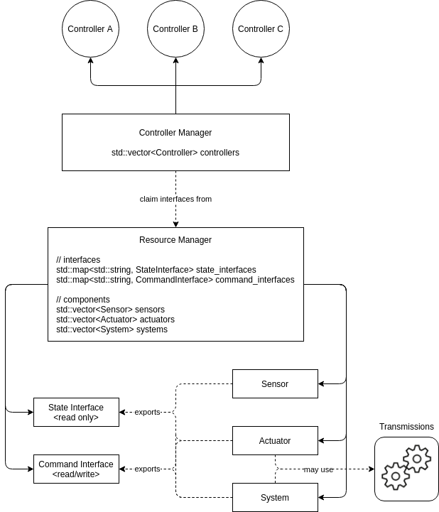

===========================
ros2_control Framework
===========================

The ros2_control is a framework for (real-time) control of robot using `ROS` (`Robot Operating System <http://ros.org>`__).
Its packages are a rewrite of `ros_control <http://wiki.ros.org/ros_control>`__ packages to simplify integration of a new hardware and overcome some drawbacks.

If you are not familiar with the control theory, please get some idea about it (e.g. at `Wikipedia <https://en.wikipedia.org/wiki/Control_theory>`_) to get familiar with the terms used in this manual.

.. contents:: Table of Contents
   :depth: 2
   
Overview
========
The ros2_control framework's source can be found in `ros-controlls/ros2_control`_ and `ros-controls/ros2_controllers`_ GitHub-repositories.
The following figure shows the Archtecture of ros2_control framework.

|ros2_control_architecture|

Controller Manager
------------------
The `Controller Manager`_ (CM) connects the controllers' and hardware-abstraction sides of the ros2_control framework.
It also serves as the entry-point for users through ROS services.
The CM implements a node without an executor so it can be integrated in custom setup.
Still, for standard user it is recommended to use default node-setup implemented in `ros2_control_node <https://github.com/ros-controls/ros2_control/blob/master/controller_manager/src/ros2_control_node.cpp>`_ file from the ``controller_manager`` package.
This manual assumes that you use this default node-setup.

On the one side, CM manages (e.g., loading, activating, deactivating, unloading) controllers and from them required interfaces.
On the other side, it has access to the hardware components (through Resource Manager), i.e., their interfaces.
The Controller Manager matches *required* and *provided* interfaces, gives controllers access to hardware's when activated or reports an error if there is a access conflict.

The execution of the control-loop is managed by the CM's ``update()`` method.
The method reads data from the hardware components, updates outputs of all active controllers and write the result to the components.

Resource Manager
----------------
The `Resource Manager`_ (RM) abstracts physical hardware and its drivers (called *hardware components*) for ros2_control framework.
The RM loads the components using ``pluginlib``-library, manages their lifecycle and components' state and command interfaces.
This abstraction provided by RM enables re-usability of implemented hardware components, e.g., robot and gripper, without any implemenatation and flexible hardware application for state and command interfaces, e.g., separate hardware/communication libraries for motor control and encoder reading.

For the execution of the control-loop the RM's ``read()`` and ``write()`` methods deal with communication to the hardware components.

.. _overview-controllers:
Controllers
-----------
The controllers in ros2_control framework have the same functionality as defined in the control theory, they compare the reference value with the measured output and based on this error calculate an system's input (for more details visit `Wikipedia <https://en.wikipedia.org/wiki/Control_theory>`_).
The controlles are objects derived from `ControllerInterface`_ (``controller_interface`` package in `ros-controls/ros2_control`_) and exported as plugins using ``pluginlib``-library.
For example of on controller check `ForwardCommandController implementation`_ in the `ros-controls/ros2_controllers`_ repository.
The controllers' lifecycle is based on the `LifecycleNode-Class`_ implementing the state machine as described in `Node Lifecycle Design`_ document.

When executing the control-loop ``update()`` method is called.
The method has access to the latest hardware's states and enables controller to write the hardware's command interfaces.

User Interfaces
---------------
Users interact with the ros2_control framework using `Controller Manager`_'s services.
Those can be used directly or through "cli"-interface (base command: ``ros2 control``).
The "cli"-interface is more user-friendly for direct interaction, i.e., outside of a node.

For list of services and their definitions check ``srv`` folder in `controller_manager_msgs`_ package.

For the description of the "cli"-interface see ``README.md`` file of the `ros2controlcli`_ package.

Hardware Components
===================
The *hardware components* realize communication to physical hardware and represent its abstraction in ros2_control framework.
The components have to be exported as plugins using ``pluginlib``-library.
The `Resource Manager`_ dynamically loads those plugins and manages their lifecycle.

There are three basic types of components:

System
  Impl

A detailed explanation of hardware components is given in the `Hardware Access through Controllers design document`_.

Hardware Description in URDF
----------------------------

Differences to ros_control (ROS1)
=================================

Hardware Structures - classes
-----------------------------

The ros_control usese ``RobotHW`` class as rigid structure to handle any hardware.
This makes impossible to extend exiting robot with additional with additional hardware, like sensors, actuators, and tools, without coding.

The ros2_control defines three different types of hardware ``Actuator``, ``Sensor`` and ``System``.
Using a combination (composition) of those basic components any physical robotic cell (robot and its surrounding) can be described.
This also means that multi-robot, robot-sensor, robot-gripper combinations are supported out of the box.
Section `Hardware Components <#hardware-components>`__ describe this in detail.

Hardware Interfaces
-------------------

The ros_control allows only three types of interfaces (joints), i.e., ``position``, ``velocity``, and ``effort``, the ``RobotHW`` class makes it very hard to use any other data to control the robot.

The ros2_control does not mandate fixed set of interface types, but they are defined as strings in `hardware's description <#hardware-description-in-urdf>`__.
To ensure compatibility of standard controllers, standard interfaces are defined as constants in `hardware_interface package <https://github.com/ros-controls/ros2_control/blob/master/hardware_interface/include/hardware_interface/types/hardware_interface_type_values.hpp>`__.

Controller's Access to Hardware
-------------------------------

In ros_control the controllers had direct access to the ``RobotHW`` class requesting access to its interfaces (joints).
The hardware itself than took care about registered interfaces and resource conflicts.

In ros2_control ``ResourceManager`` takes care about state of available interfaces in the framework and enable controller to access the hardware.
Also, the controllers does not have direct access to hardware anymore, but they register their interfaces to the `ControllerManager`.

Migration Guide
---------------

.. _ros-controls/ros2_control: https://github.com/ros-controls/ros2_control
.. _ros-controls/ros2_controllers: https://github.com/ros-controls/ros2_controllers
.. _ros-controls/ros2_control_demos: https://github.com/ros-controls/ros2_control_demos
.. _Controller Manager: https://github.com/ros-controls/ros2_control/blob/master/controller_manager/src/controller_manager.cpp
.. _controller_manager_msgs: https://github.com/ros-controls/ros2_control/tree/master/controller_manager_msgs
.. _ControllerInterface: https://github.com/ros-controls/ros2_control/blob/master/controller_interface/include/controller_interface/controller_interface.hpp
.. _ForwardCommandController implementation: https://github.com/ros-controls/ros2_controllers/blob/master/forward_command_controller/src/forward_command_controller.cpp
.. _Resource Manager: https://github.com/ros-controls/ros2_control/blob/master/hardware_interface/src/resource_manager.cpp
.. _LifecycleNode-Class: https://github.com/ros2/rclcpp/blob/master/rclcpp_lifecycle/include/rclcpp_lifecycle/lifecycle_node.hpp
.. _Node Lifecycle Design: https://design.ros2.org/articles/node_lifecycle.html
.. _ros2controlcli: https://github.com/ros-controls/ros2_control/tree/master/ros2controlcli
.. _Hardware Access through Controllers design document: https://github.com/ros-controls/roadmap/blob/master/design_drafts/hardware_access.md

